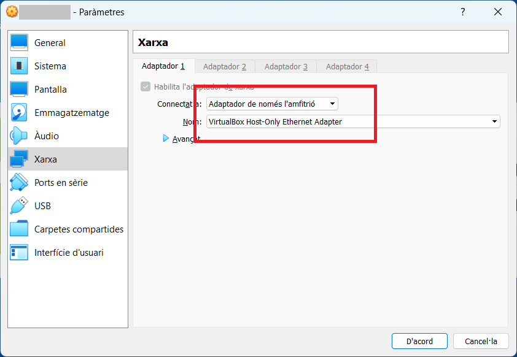

https://github.com/joanpardogine/mp07-uf04-a19u-servidor-web-windows/blob/main/mp07-uf04-a19u-servidor-web-windows-main.zip


## **Exàmen 18 de maig de 2023**

### Aquest examen consisteix en fer tots els següents passos:

En començar l'activitat la configuració de l'adapatador de xarxa virtual ha d'estar com es mostra a continuació:




<br>

# **1.** Canvia el **nom al servidor**

<br>

# **2.** Canvia l'**adreça IP del servidor**, l'adreça fixa del servidor cal que sigui la següent:

<br>

> # &nbsp;&nbsp;&nbsp;&nbsp;*```192.168.```*****```<NumeroMesNaixmanentAlumne>```*****```.1```*

<br>

# **3.** Canvia l'**adreça IP de la interfície de xarxa del teu portàtil**, a l'adreça fixa del servidor cal que sigui la següent:

<br>

> # &nbsp;&nbsp;&nbsp;&nbsp;*```192.168.```*****```<NumeroMesNaixmanentAlumne>```*****```.100```*

<br>

# **4.** Què volen dir les sigles **```IIS```**?

<br>

En el servidor, descarregats localment teniu els següents fitxers:

<br>

*  [**```php-7.4.33-nts-Win32-vc15-x64.zip```**](./files/php-7.4.33-nts-Win32-vc15-x64.zip) (24,92 MB (26.132.214 bytes)).

<br>

*  [**```VC_redist.x86.exe```**](./files/VC_redist.x86.exe)

<br>

*  [**```info.php```**](./files/info.php)

<br>

# **5.** Fer la instal·lació del **```IIS```**.

<br>

# **6.** Fer la instal·lació i configuració de **```PHP```**.

<br>


<!-- https://techexpert.tips/es/windows-es/instalacion-de-iis-en-windows/

https://techexpert.tips/es/windows-es/instalar-php-en-windows-server-iis -->
